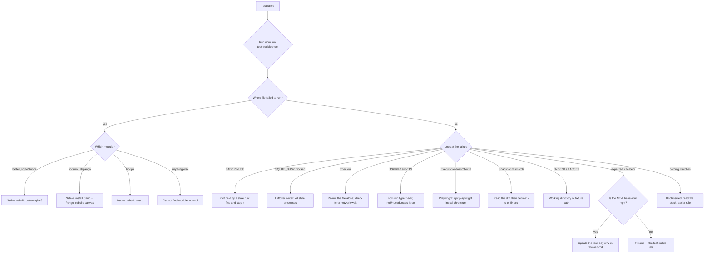

# TROUBLESHOOTING — what to do when a test fails

This repository has tests. It did not, until now, have an answer to the question
a failing test immediately raises: **what do I do next?**

`npm test` tells you *which* test failed and prints a diff. It cannot tell you
whether that failure is your change, a stale `node_modules`, a native addon built
for a different Node, a port someone left open, or a browser binary this machine
does not have. Those five have completely different fixes, and they all look
identical in the default output.

This document is the runbook. Two things are wired into it:

1. **A reporter that fires automatically.** Every `npm test` ends with a
   `═══ TEST TROUBLESHOOTER ═══` block that classifies each failure and prints
   next steps. Inert when the suite is green.
2. **A deeper, re-runnable pass:** `npm run test:troubleshoot` — runs the suite,
   pre-flights the environment, and explains every failure.

---

## The 30-second version

```
npm test                       # the suite; failures are classified automatically
   │
   └── still stuck?  npm run test:troubleshoot
                     npm run test:troubleshoot -- --file test/that-one.test.ts
                     npm run test:troubleshoot -- --json      # for tooling
                     npm run test:troubleshoot -- --no-run    # environment only
```

If the classification is wrong or useless, that is a bug in
`test/troubleshooter.ts` — add a rule and pin it with a test in
`test/troubleshooter.test.ts`. Every rule in this document is already pinned.

---

## The decision flowchart



Same thing as plain text, for a terminal:

```
                      ┌─ did the whole FILE fail to run? ──────────────┐
                      │  yes → which module?                          │
                      │        better_sqlite3.node → rebuild native   │
                      │        libcairo/libpango   → install + rebuild│
                      │        libvips             → rebuild sharp    │
                      │        anything else       → npm ci           │
    TEST FAILED ──────┤                                               │
                      │  no  → what does the message say?             │
                      │        EADDRINUSE          → free the port    │
                      │        SQLITE_BUSY         → kill stale runs  │
                      │        timed out           → re-run alone     │
                      │        error TS####        → npm run typecheck│
                      │        Executable doesn't… → install Chromium │
                      │        Snapshot mismatch   → read diff first  │
                      │        ENOENT / EACCES     → cwd or fixture   │
                      │        expected X to be Y  → which side is    │
                      │                              wrong? fix THAT  │
                      │        none of the above   → read the stack,  │
                      │                              add a rule       │
                      └───────────────────────────────────────────────┘
```

---

## The rules, and what each one means

The category id is printed in square brackets after every diagnosis, so you can
find it here.

| id | It means | First thing to try |
| --- | --- | --- |
| `native-better-sqlite3` | The native addon is missing, or was built for another Node ABI | `npm rebuild better-sqlite3 --build-from-source` |
| `native-canvas` | Cairo/Pango are absent, so the raster PDF tier cannot run | install the Cairo/Pango dev packages |
| `sharp` | libvips is absent | `npm rebuild sharp --build-from-source` |
| `missing-module` | `node_modules` disagrees with `package-lock.json` | `npm ci` |
| `port-in-use` | A previous run still holds the port the suite binds | find and stop it |
| `database-locked` | Two writers on one SQLite file | kill stale `vitest` / `tsx` processes |
| `timeout` | Genuinely slow, or blocked on something that never arrives | re-run the file alone |
| `playwright-missing` | Real-browser test cannot start | `npx playwright install chromium` |
| `snapshot` | Stored output disagrees with current output | **read the diff before anything else** |
| `typescript` | A type error reached the test run | `npm run typecheck` |
| `external-credentials` | A test reached for a real API or key | use the mock adapters |
| `missing-file` | Fixture absent, or wrong working directory | run from the repo root |
| `permission` | Not allowed to read/write a path | check ownership |
| `unhandled` | An exception escaped the test or a hook | read the first `src/` frame |
| `assertion` | Ordinary wrong-value failure | decide which side is wrong |
| `unknown` | Nothing matched | read the stack; consider adding a rule |

---

## Native modules

The three native dependencies (`better-sqlite3`, `canvas`, `sharp`) are the most
common cause of a suite that fails *everywhere at once* rather than in one test.
They are binaries tied to a Node ABI, so they break on upgrade, and their
fallback source build needs Node headers.

**Symptom**

```
Error: Cannot find module '../build/Release/better_sqlite3.node'
Error: The module was compiled against a different Node.js version using NODE_MODULE_VERSION 115
```

**Fix**

```bash
npm rebuild better-sqlite3 --build-from-source
```

If that build cannot download Node headers (an offline box, or a proxy that
blocks `nodejs.org`), point it at the headers Node already ships with:

```bash
npm_config_nodedir="$(dirname "$(dirname "$(which node)")")" \
  npm rebuild better-sqlite3 --build-from-source
```

Confirm with:

```bash
node -e "new (require('better-sqlite3'))(':memory:'); console.log('ok')"
```

`canvas` additionally needs Cairo and Pango at build time:

```bash
sudo apt-get install -y build-essential libcairo2-dev libpango1.0-dev \
  libjpeg-dev libgif-dev librsvg2-dev
npm rebuild canvas --build-from-source
```

`canvas` being unavailable is a **known accepted gap** — see **BUGS.md ENV-2**.
The product is built to fall back to a human queue rather than guess at an
unreadable document, so the raster-only paths degrade safely. Do not weaken the
assertions to make them pass; record the skip.

---

## Installation

**Symptom** — `Cannot find module '<anything>'`, `Failed to resolve import`.

`node_modules` is out of sync with `package-lock.json`. Usually caused by
switching branches, or by an install that was run with `--ignore-scripts` (which
skips native builds entirely).

```bash
npm ci --no-audit --no-fund
npm test
```

---

## Ports

**Symptom** — `EADDRINUSE: address already in use`.

The web tests bind a real port. A previous run that did not exit still owns it.

```bash
lsof -i :<port>          # or: ss -ltnp | grep <port>
pkill -f vitest
npm test
```

---

## Database

**Symptom** — `SqliteError: database is locked`, `SQLITE_BUSY`.

The suite is built to be serialisable, so a busy database nearly always means a
leftover process or a test that did not close its database.

```bash
pkill -f vitest ; pkill -f "tsx src/cli"
git status --porcelain | grep sqlite     # stray temp databases
npm test
```

---

## Timeouts

**Symptom** — `Test timed out in 180000ms`.

`testTimeout` and `hookTimeout` are both 180s (`vitest.config.ts`), so a breach
is a real signal, not a slow machine. Two causes:

- **Load.** Under full-suite parallelism OCR and PDF work can overrun. Re-run the
  file alone: `npx vitest run test/that.test.ts`.
- **A wait that never ends.** The suite must run with **no network**. If a test
  is waiting on a real HTTP call, it is not using the mock adapters.

Raise the timeout on the individual test if it is genuinely slow. Do **not**
raise the global one — that hides the signal for everything else.

---

## Snapshots

**Symptom** — `Snapshot mismatch`, `snapshot not found`, `obsolete snapshot`.

**Read the diff before you run anything.** A snapshot records what the code
*used* to do; the mismatch is telling you it now does something else. Which one
is correct is a judgement, not a command.

- New behaviour is right → `npx vitest run -u`
- New behaviour is wrong → fix `src/`, leave the snapshot alone

---

## Assertions

**Symptom** — `expected X to be Y`, `AssertionError`.

This is the ordinary case, and it is the one people most often "fix" the wrong
way. Decide which side is wrong:

- The **expectation** is stale because behaviour changed on purpose → update the
  test and **say so in the commit message**. A test that was quietly edited to
  match new behaviour is worse than no test.
- The **behaviour** is wrong → fix `src/`. The test just did its job.

If the test is asserting on something the product deliberately leaves to a
person, check BUGS.md first — a surprising assertion is often a documented
safety behaviour being pinned.

---

## Working directory

**Symptom** — `ENOENT: no such file or directory`, `EACCES: permission denied`.

Run from the repository root:

```bash
cd "$(git rev-parse --show-toplevel)" && npm test
```

Some tests deliberately change directory and start the server from **outside**
the repository (see `test/boot-outside-repo.test.ts`) to prove the app does not
depend on its own source tree at runtime. If one of those fails, check that it
restores the working directory on the way out.

---

## Unhandled

**Symptom** — `Unhandled Rejection`, `Uncaught Exception`, or an error naming a
hook (`beforeAll` / `afterAll`).

The stack is the only clue. The first frame that lives inside `src/` is nearly
always the real culprit. If the error names a hook, the failure is in
setup/teardown, not in the test body — and it will usually take every test in
the file down with it.

---

## Unclassified

**Symptom** — `[unknown]`.

None of the rules matched. Either this is a new failure mode, or an environment
gap the troubleshooter has not seen.

1. Read the message and stack — they are printed verbatim.
2. Re-run the file alone: `npx vitest run test/that.test.ts`.
3. If it is repeatable and environmental, **add a rule** to
   `test/troubleshooter.ts` and pin it in `test/troubleshooter.test.ts` so the
   next person gets the answer instead of the puzzle.

The classifier is pure and dependency-free on purpose. Adding a rule is a
five-line change.

---

## Before you push

The gates CI runs (`.github/workflows/ci.yml`), in the order it runs them:

```bash
npm run typecheck     # tsc --noEmit — noUnusedLocals makes unused imports fatal
npm test              # the suite; failures are classified for you
npm run simulate      # scenario simulation
npm run stress        # stress harness
npm run build         # tsc output + the pdf.js bridge
```

A green `npm test` on a machine that never built `canvas` is **not** the same as
green on CI — see **BUGS.md ENV-2**. Say which one you ran.
